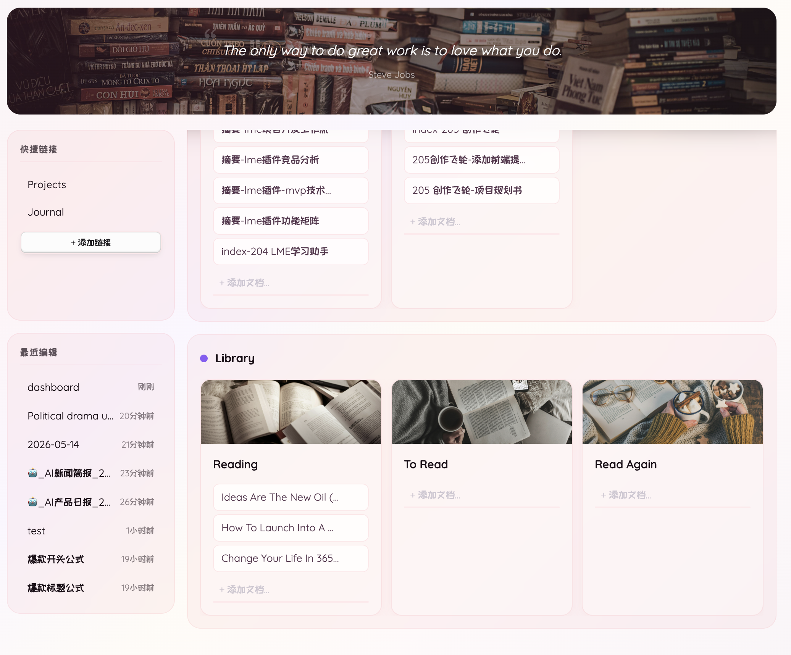
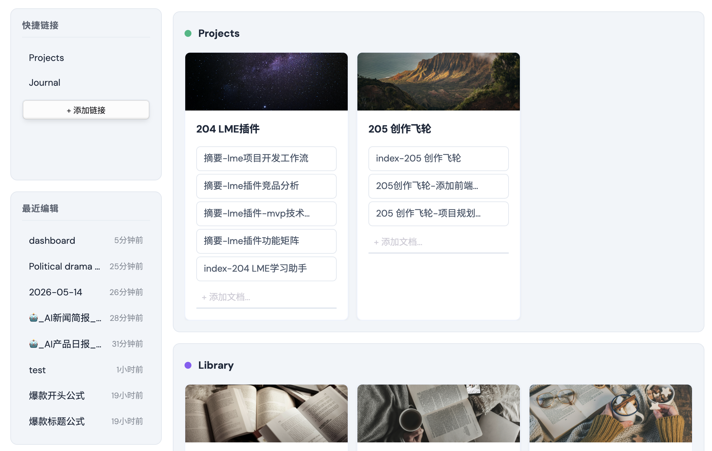

# Apex Dashboard

> Stop switching between Obsidian notes. One page. Everything you need. Memo your thoughts, crush your todos, track your projects — and make it look incredible doing it. [【中文版】](README_ZH.md)

## Screenshot

## Features

### 🗒️ Memo
Capture thoughts instantly with a built-in memo pad. Each memo card has a writable textarea — jot down ideas, meeting notes, or daily reflections without leaving your dashboard. Supports `[[wikilinks]]` that render as clickable links.

### ✅ Todo
Manage tasks with interactive checklists. Add, reorder, drag-and-drop, and check off tasks. A progress bar shows completion percentage at a glance. Todo items also support `[[wikilinks]]` for cross-referencing notes.

### 📁 Projects
Organize your vault documents into project cards. Each card links to related notes, displays a cover image (supports both local vault images and web URLs), and supports inline document search to add new files quickly. Manage multiple file types including Markdown notes, PDFs, images, audio, and video.

### 📝 Notes
A compact, list-style section for organizing reference documents and quick-access files. Displays up to 5 cards per row without cover images for maximum density.

### ⚡ Quick Actions
Pin your most-used shortcuts to the sidebar. Supports two action types: **File** links to open any document, and **Command** shortcuts to trigger any Obsidian command. Includes built-in presets for New Journal and New Note.

### 🎨 Banner
A customizable banner with an inspirational quote and optional background image. Supports both local vault images and web URLs. Double-click to edit.

### 🔄 Drag & Drop
Drag cards between sections to reorganize your workspace. Drag task items within Todo cards to reorder.

### 🧩 Custom Sections
Create sections with 4 built-in types — **Memo**, **Todo**, **Projects**, and **Notes** — each with its own layout and behavior. Mix and match to fit your workflow.

### 🕐 Recent Documents
The sidebar shows recently edited files with relative timestamps, so you can jump back into your latest work.

## Themes

5 handcrafted themes, each with distinct visual identity:

| Theme | Style |
|-------|-------|
| **Earth** | Warm organic tones, parchment textures |
| **Nordic** | Clean minimal with blue accents |
| **Cyan** (Neon) | Cyberpunk sharp, cyan-on-dark |
| **Aurora** | Frosted glass with animated aurora gradient |
| **Spring** (Prism) | Rose glass with warm glow |

All themes support both Obsidian light and dark modes. Lime and Apex enforce a dark aesthetic regardless of system preference.

## Settings

- **Dashboard file** — customize the file path for your dashboard data
- **Style** — choose from 5 visual themes
- **Language** — English or Chinese interface
- **Recent documents count** — control how many recent files appear

## Installation

### From Obsidian Community Plugins (coming soon)
1. Open Settings > Community Plugins
2. Search for "Apex Dashboard"
3. Click Install, then Enable

### Manual Installation
1. Download the latest release from [GitHub Releases](https://github.com/pandorareads/apex-dashboard/releases)
2. Extract into your vault's `.obsidian/plugins/apex-dashboard/` folder
3. Open Settings > Community Plugins and enable "Apex Dashboard"

## Usage

1. Open the dashboard via the ribbon icon (home icon) or command palette: `Apex Dashboard: Open dashboard`
2. A `dashboard.md` file is automatically created in your vault root
3. All changes are saved directly to the file — it's your data, in plain text

> **Note:** Deleting, renaming, or reordering sections must be done by editing the `dashboard.md` file directly. Any changes made to the note will take effect in the dashboard view immediately.

## What's New

### v1.0.4
- **Quick Actions** — Quick Links upgraded to Quick Actions, supporting both file links and Obsidian command shortcuts
- **Add Action modal** — Two tabs (File / Command) for adding custom actions, with built-in presets for New Journal and New Note
- **4 Section types** — Memo, Todo, Projects, and Notes, each with its own layout and behavior
- **Multi-format document support** — Manage Markdown, PDF, images (PNG, JPG, GIF, SVG, WebP), audio (MP3, M4A), and video (MP4, MOV) in project cards
- **Bidirectional links** — Memo and Todo cards render `[[wikilinks]]` as clickable links with basename fallback
- **Journal path setting** — Configure where new diary entries are saved
- **UI polish** — Vertical scrollbars hidden on desktop, theme-colored horizontal scrollbar, notes section layout optimization
- **Bug fixes** — Fixed wiki link clicks in memo cards, quick link rename race condition, rename listener cleanup on plugin unload

### v1.0.3
- **Wikilink support** — Memo and Todo cards now render `[[wikilinks]]` as clickable links
- **Section type selector** — Choose section type when creating new sections
- **Mobile sidebar drawer** — Slide-in animation for mobile navigation
- **Section creation UX** — Confirm button for mobile section creation, 'Add new section' command shortcut
- **Bug fixes** — Card drag restricted to header/cover area, mobile banner edit button, drawer alignment

### v1.0.2
- **Section management** — Manual section deletion, section type selector
- **Mobile improvements** — Better card scrolling and mobile layout
- **Bug fixes** — Respect body section order, form reset prevention

## Compatibility

- Obsidian v0.15.0+
- Desktop and mobile
- All themes work in both light and dark Obsidian modes

## License

0BSD
