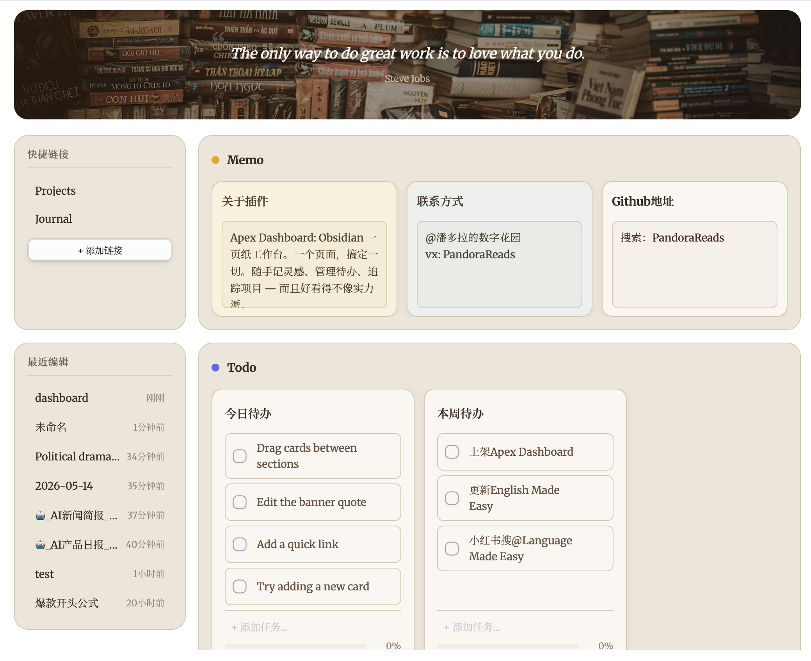

# Peingxious Dashboard

> Obsidian 一页纸工作台。一个页面，搞定一切。随手记灵感、管理待办、追踪项目 — 而且好看得不像实力派。

## 截图预览



## 功能特色

### 🗒️ Memo（备忘）

内置便签式 Memo 卡片，每张卡片都有可编辑文本区域，随时记录灵感、会议笔记或每日反思，无需离开仪表盘。支持 `[[双链]]` 渲染为可点击链接，轻松关联笔记。

### ✅ Todo（待办）

交互式任务清单，支持添加、拖拽排序、勾选完成。底部进度条以百分比实时显示完成进度。待办项同样支持 `[[双链]]`，方便交叉引用。

### 📁 Projects（项目）

将 Vault 文档组织为项目卡片。每张卡片可关联多篇笔记，支持封面图片（支持本地 Vault 图片和网络图片链接）和内联文档搜索，快速添加文件。支持管理多种文件类型，包括 Markdown 笔记、PDF、图片、音频和视频。

### 📝 Notes（笔记）

紧凑的列表式分区，用于整理参考文档和快捷访问文件。每行最多显示 5 张卡片，无封面图片，最大化信息密度。

### ⚡ 快捷操作

将常用快捷方式固定到侧边栏，支持两种操作类型：**文件**链接可打开任意文档，**命令**快捷方式可触发任意 Obsidian 命令。内置新建日记和新建笔记预设。

### 🎨 Banner（横幅）

可自定义的横幅区域，支持编辑引言和背景图片（支持本地 Vault 图片和网络图片链接）。双击即可修改。

### 🔄 拖拽排列

在分区之间拖拽卡片来重新组织工作空间，也可以在 Todo 卡片内拖拽任务项进行排序，还支持在 Projects/Notes 卡片之间拖拽文档链接。

### 🧩 自定义分区

创建分区时可选择 4 种内置类型 — **Memo**、**Todo**、**Projects**、**Notes** — 每种类型都有独立的布局和行为。自由组合，打造专属工作流。

### 🕐 最近文档

侧边栏展示最近编辑的文件及相对时间，快速回到最近的工作。

## 主题

Dashboard 自动跟随 Obsidian 原生主题色，完美适配所有社区主题的亮色和暗色模式，无需额外配置。

## 设置选项

- **Dashboard 文件路径** — 自定义仪表盘数据文件的存放路径
- **语言** — 支持英文和中文界面
- **最近文档数量** — 控制侧边栏显示的最近文件数量
- **默认钉住侧边栏** — 打开工作台时，右侧边栏始终保持展开状态
- **隐藏项目嵌套文档** — 项目卡片中仅显示顶层文档，子文档隐藏但保留数据
- **Todo 默认隐藏已完成任务** _（默认：开）_ — 开启后，新建 Todo 卡片在列表中默认隐藏已完成任务；卡片右上角的眼按钮仍可临时切换单卡片（仅本次会话生效，不会写入笔记）
- **排除的笔记** — 在「打开」面板中隐藏的笔记名称或路径，逗号分隔（如 `dashboard, area/workbench`）。主工作台文件默认排除
- **侧边栏小组件** — 天气 / 热力图 / 番茄钟 / 阅读 / 倒计时，可独立开关与配置
- **阅读设置** — 开关阅读追踪、是否启用会话完成音效

## 安装

### 从 Obsidian 社区插件市场安装

1. 打开 设置 > 第三方插件
2. 浏览并搜索 "Peingxious Dashboard"
3. 点击安装，然后启用

### 手动安装

1. 从 [GitHub Releases](https://github.com/pandorareads/peingxious-dashboard/releases) 下载最新版本
2. 解压到 Vault 的 `.obsidian/plugins/peingxious-dashboard/` 目录
3. 打开 设置 > 第三方插件，启用 "Peingxious Dashboard"

## 使用方法

1. 通过左侧功能区图标（主页图标）或命令面板打开：`Peingxious Dashboard: Open dashboard`
2. 首次使用会在 Vault 根目录自动创建 `dashboard.md` 文件
3. 所有更改直接保存到文件 — 纯文本格式，你的数据完全属于你

### 文件格式

Dashboard 使用缩进 bullet 列表格式组织数据：

```markdown
## Memo

- 2026-06-08 备忘
  - 欢迎使用 Peingxious Dashboard！点击此处编辑你的第一条备忘。

## Todo

- 待办清单
  - [ ] Review dashboard plugin code
  - [ ] Write documentation
  - due: 2025-05-20

## Projects

- Obsidian Dashboard
  - [[obsidian-dashboard/README.md]]
  - progress: 60
```

- `##` 标题定义分区
- 顶级 `-` 定义卡片标题
- 缩进的 `\t-` 定义卡片内容（文本、任务、元数据等）
- 任务使用 `- [ ]` / `- [x]` 格式
- 元数据使用 `key: value` 格式（如 `due:`、`progress:`、`link:`）

> **提示：** 每个分区标题右侧有垃圾桶按钮，可直接在 Dashboard 界面中删除分区。

## 更新日志

### 1.3.0

- **新增全局设置：Todo 默认隐藏已完成任务** — 设置面板新增开关（默认开启）。开启后，每个 Todo 卡片在首次渲染时隐藏列表中的已完成任务。卡片右上角的眼按钮仍可作为快速"显示/隐藏"切换，但该切换仅在本次会话内生效，不再写入工作台笔记
- **`hideCompleted: true` 不再写入工作台笔记** — 工作台文件保持干净；该字段仅在渲染时由全局设置和内存中的卡片标志共同决定

### 1.2.0

- **重命名：Apex Dashboard → Peingxious Dashboard** — 插件 ID（`peingxious-dashboard`）、显示名、作者、描述全部更新。npm 包名变更为 `peingxious-dashboard`。内部类名（`.peingxious-dashboard-root`、`.peingxious-note-dashboard-root`）、视图类型（`peingxious-dashboard-view`、`peingxious-dashboard-sidebar`）、`localStorage` 键、`peingxious-dashboard-template` YAML 标记、`[peingxious-dashboard]` 日志 tag 全部跟随新命名
- **作者变更为 Peingxious** — `manifest.json` `author` 字段现为 `Peingxious`
- **重写插件描述** — 新文案反映扩展后的功能面（备忘、待办、项目、资料库、天气、快捷链接）并贴合新品牌

### 1.1.17

- **修复：文件下拉框不再出现固定高度的空白背景** — 之前 `positionDropdown()` 硬性设置了 `min-height: 220px`，导致只有 1-2 个匹配项时下拉框下方留出一大块空黑区，看起来像「两个面板叠加」。现已改为内容驱动：只设 `maxHeight`（上限为输入框下方的可用空间），内部列表容器用 `flex: 0 1 auto` 跟随项数伸缩。单条结果时下拉框收紧到约 52px，不再有空白
- **修复：输入 `【【`（全角双括号）也能触发下拉框** — 之前 `findWikilinkContext()` 只识别 ASCII `[[`，中文输入法环境下用全角括号根本弹不出下拉框。现在 ASCII 和全角都会触发；pick 时保留用户输入的那种括号风格（`[[` 配 `]]`，`【【` 配 `】】`）。混合输入（如 `【【abc]]`）视为已闭合，下拉框不会反复弹出
- **修复：选中文件时保留 `[[` 之前已输入的前导文字** — 之前 replace 会把整个输入框覆盖掉，用户在 `[[` 前面打的「review 」「笔记 」之类的前缀全没了。现在 `applyWikilinkReplacement()` 只替换 `[[…` 片段，`review [[xyz` + 选中 → `review [[Foo]]`，而不是只剩 `[[Foo]]`。同时如果用户已经手动打出了 `]]` / `】】`，会一并清掉，避免出现 `[[Foo]]]` 这种多尾巴
- **新增：wikilink 上下文纯逻辑单测** — 把检测 / 替换逻辑从 `src/file-suggest.ts` 抽到 `src/wikilink-context.ts`（不依赖 obsidian 包），新增 `tests/wikilink-context.test.mjs` 覆盖 27 个场景：空输入、单个括号、ASCII / 全角 opener、孤立前导括号、alias / section 语法、换行、光标在 query 中间、前后缀保留、混合闭合括号。运行方式：`npm test`

### 1.1.14

- **项目项 wikilink：原生 Page Preview 在普通 hover 触发；卡片标题不启用** — 1.1.14 初版加了 `title` 属性导致普通 hover 显示浏览器原生 tooltip（包括卡片标题 "To Read" 上的小标签），与用户期望不一致，移除该属性。Page Preview（富弹窗）现在是唯一的 hover 行为，**普通 mouseover 200ms 后触发，不再需要 Ctrl/Cmd**。通过 `renderTextWithLinks(..., { enableHover: true })` 显式开启，目前只对 project-item 标题 span 启用；卡片标题、task 文本、note 文本均不启用，hover 它们不会有任何反应
- **撤销 1.1.12「分区标题尾号拆成 #N 角标」改动** — 分区名是用户可见的标签（`library`、`Project 5`、`121`、`闪念-2026-01月`），不是 id。1.1.12 把它拆成「标题文本 + 数字角标」等于把「名字」变成了「编号」，且当分区名就是纯数字时会出现空 `<h3>`。本次还原成把完整 `column.name` 直接渲染到 `<h3>` 文本节点里，与其他分区名展示方式完全一致。同时移除 `splitTrailingNumber()` 辅助函数、`.dashboard-section-number-badge` CSS、`renderer.columnNumberBadge` i18n 文本；重命名输入框预填、取消恢复都用完整 `column.name`

### 1.1.13

- **项目项 wikilink 支持 Ctrl/Cmd+悬浮原生文件预览** — 工作台里的项目项是自定义 DOM（不走 markdown post-processor），Page Preview 核心插件根本感知不到，按住 Ctrl/Cmd 悬浮时没反应。修复方法是手动派发 workspace 级别的 `link-hover` 事件（与 markdown post-processor 派发的是同一个），并附上正确的 `MouseEvent`、目标元素、链接文本和 source 字符串。200ms 延迟触发避免误触，mouseleave / keydown / 节点被卸载都会取消定时器。派发后 Obsidian 原生 Page Preview 会接管，弹出的就是和图 2 一样的文件预览面板——支持 fragment 跳转、embed 渲染、"在新面板中打开"等所有原生能力

### 1.1.12

- **分区标题：尾部数字抽离为角标** — _已在 1.1.14 撤销_（分区名是用户可见的标签，不是 id）

### 1.1.11

- **File-suggest：输入时无预选 + 高亮回归克制** — 输入时下拉不再预选第一行，按 ↓/↑ 才会移动高亮。1.1.10 的紫渐变 + 3px 粗左边框 + 加粗被反馈太重，现在改为 `rgba(99, 102, 241, 0.18)` 软底色 + 1px 内嵌边线，无粗体无边框。hover 仍用 CSS 强调色作实色填充，与"已选中"区分开

### 1.1.10

- **修复：File-suggest 下拉 ↑/↓ 导航时高亮不可见** — 之前给所有 row 写了 inline `background: transparent`，内联样式优先级压过了 CSS 里的 `.is-selected` 高亮规则，结果按上下键切换时行根本没变色。修复后只在被选中的行上设置 inline 背景（紫→浅紫渐变 + 3px 浅紫左边框 + 加粗），未选中行不再写 inline 背景，CSS `:hover` 也能正常上色（之前 hover 同样被透明覆盖）

### 1.1.9

- **修复：File-suggest 下拉不再按 Enter 就自动选中第一项** — 之前在添加笔记等带文件搜索的输入框里，输入文字后直接回车会把第一条匹配的文件名覆盖到输入框，把用户刚敲入的文字冲掉。修复后高亮行仍是第一条匹配（视觉提示），但若用户没有先按 ↑/↓ 导航就直接回车，输入框里的文字保持不变，调用方读到的是用户真实输入。鼠标点击行仍然正常选择；每次查询变更会重置"已确认"状态，旧查询的选中不会泄漏到新查询

### 1.1.8

- **工作台支持 Ctrl/Cmd+Z 撤销** — 在工作台中按 Ctrl+Z（macOS 为 Cmd+Z）即可恢复最近一次被删除的卡片、todo 任务、项目项或分区。每次一键删除前会先把被移除的数据快照到内存的撤销栈（最多 50 条），撤销后视图自动重绘并用 Notice 提示恢复了什么类型的内容。Obsidian 编辑器自带的文本撤销在输入框 / textarea / contenteditable 元素内仍然正常工作——全局 keydown 监听会先检查焦点元素，命中即跳过
- **命令面板入口** — 同一撤销动作以「撤销最近一次删除」出现在命令面板中，绑定 Ctrl/Cmd+Z。当撤销栈为空时 `checkCallback` 返回 false，命令自动从面板中隐藏

### 1.1.7

- **统一行内删除交互** — todo 任务与 project/笔记项的删除按钮统一为同一个红色小 X 胶囊。悬停时显示，4px 圆角，hover 时填充主题 danger 色（红色）。project 项上原本的"大红 X + 删除任务 tooltip"已被替换为与 todo 一致的紧凑样式
- **点击即删** — todo 任务、project 项、卡片头部的 X 按钮现在都是**点击直接删除**（沿用 project 的一键删除行为），不再弹出"Are you sure?"二次确认弹窗

### 1.1.6

- **Library 列表视图 — 胶囊元数据行** — 属性值以圆角胶囊样式（无 key 标签）内联显示，紧邻每行末尾的时间值。胶囊沿用原有的圆角边框与浅色背景观感，**时间值仍为最末元素**，所有已配置属性都紧贴在其之前。整体观感与表格视图的列顺序保持一致，列表与表格之间的视觉语义统一

### 1.1.5

- **Library 表格/列表视图 — 显示属性** — 用户可按需勾选要在表格视图中显示为列、或在列表视图中显示为元数据 chip 的属性字段。在「配置数据库」弹窗中新增「显示属性」section，**仅当视图模式为表格或列表时显示**。取消勾选可隐藏对应属性；提供「全选」「全不选」快捷操作。未配置（兼容旧 config）时维持原有的自动发现行为，完全向后兼容
- **看板视图专属设置保持隔离** — 「分组依据」section 继续**仅在视图模式为看板时显示**，不渗透到表格 / 列表 / 网格配置

### 1.1.3

- **移动端小组件栏重构** — 将覆盖在 Banner 上的标签按钮改为 Banner 下方的可折叠横条。点击横条展开书签标签（番茄钟、阅读、农历），再点击标签展开对应的小组件面板
- **主题自适应标签颜色** — 标签图标从灰色（未激活）过渡到主题主文字颜色（激活），同时适配亮色和暗色主题
- **更宽的标签按钮** — 标签按钮宽度增加，更易点击
- **更新小组件图标** — 番茄钟使用沙漏图标，农历使用月亮图标，视觉识别更清晰
- **自定义对话框** — 用 Obsidian 风格的自定义弹窗替代原生浏览器对话框
- **类名规范化** — 清理内部类命名约定
- **样式优化** — 多处视觉打磨和一致性修复

### 1.1.2

- **Obsidian 插件审核修复** — 回应官方 Obsidian 插件审核流程的反馈
- **MIT 许可证** — 许可证从 ISC 更改为 MIT

### v1.1.1

- **Library 配置持久化** — 修复关键 Bug：数据库分区的配置（筛选条件、视图模式、排序设置、每页数量）在重启 Obsidian 后丢失。YAML 解析器现在能正确处理列定义中的嵌套对象
- **网格位置持久化** — 修复网格定位值（gcol/grow）从未被保存到 dashboard 文件的问题，导致卡片位置在重载后重置
- **写入竞态修复** — 修复快速连续更新时文件监视器可能用旧数据覆盖新数据的竞态条件

### v1.0.7

- **任务提醒** — 为每个任务设置提醒时间。点击任务旁的铃铛图标，通过日历弹窗选择日期和时间
- **日历选择器** — 可视化月历弹窗，支持翻月、点选日期、小时和分钟下拉选择（无需手动输入日期）
- **过期提醒** — 过期任务的铃铛图标变红并带脉冲动画
- **Obsidian 通知** — 60 秒定时检查，任务到期时弹出 Obsidian Notice 通知
- **Markdown 内联存储** — 提醒以 `⏰ YYYY-MM-DD HH:MM` 格式存储在任务文本中，可在 Markdown 文件中直接查看和编辑
- **岛屿主题** — 全新动物森友会风格柔和色调主题，森林绿分区配海洋蓝点缀
- **国际化** — 提醒 UI 支持中英文
- **分区卡片拖拽伸缩** — 所有分区卡片支持拖拽调整宽度，带最小/最大宽度约束，尺寸自动持久化
- **可伸缩侧边栏** — 左侧边栏可自由伸缩调整宽度，点击图钉按钮可固定侧边栏
- **6 款新主题** — 苔原（鼠尾草绿极光）、花漾（玫瑰柔光透明分区）、薄雾（烟雾蓝雾玻璃质感）、余烬（暖烟篝火渐变）、暮霞（紫色暮光薄雾）、翡翠（翠绿竹雾）
- **透明分区** — 苔原、花漾、薄雾、余烬、暮霞、翡翠均采用无边框透明分区，卡片悬浮显示
- **Banner 遮罩移除** — Banner 图片不再被半透明滤镜覆盖
- **加速轮播** — 名言每小时轮换，图片每 30 分钟轮换

### v1.0.6

- **多名言轮播** — Banner 支持存储多条名人名言，可在编辑弹窗中添加、编辑和删除
- **背景图轮播** — 支持添加多张背景图片，每 2 小时自动切换，带淡入淡出过渡效果
- **名言自动轮播** — 名言每 2 小时自动切换（与背景图错开 1 小时，不会同时切换）
- **双击重命名分区** — 双击任意分区标题即可内联编辑名称（Enter 保存，Escape 取消）
- **分区折叠** — 点击分区标题左侧的倒三角可折叠/展开分区，折叠状态跨会话保留
- **跨卡片拖拽** — 支持在 Projects/Notes 卡片之间拖拽文档链接，在 Todo 卡片之间拖拽任务项
- **卡片排序修复** — 修复所有分区（待办、项目、笔记）的卡片拖放定位问题，卡片现在会精确放置到拖放位置
- **空卡片交互** — 清空所有项目后的卡片仍可通过拖拽或输入框添加新内容

### v1.0.5

- **移动端优化** — 隐藏备忘录调色板按钮、抽屉使用实色背景适配所有主题、快捷操作列表加高显示
- **分区类型颜色** — 四种分区类型（备忘、待办、项目、笔记）各有独立的倒三角颜色
- **横幅弹窗按钮尺寸** — 编辑横幅弹窗中的「添加名言」和「添加图片」按钮改为自适应宽度，不再撑满整行
- **项目卡片默认宽度** — 修复新建项目卡片拉伸占满整个分区的问题，卡片现在使用 280px 默认宽度
- **分区类型加固** — 三层防御体系确保分区类型不丢失：frontmatter type 字段、名称推断、卡片类型分布分析。支持手动编辑文件、重命名标题、调换位置等场景
- **项目卡片类型持久化** — `type: project` 现在会写入文件并在保存/重载后保留，防止卡片类型回退为 generic
- **默认模板修复** — Projects 和 Library 分区在默认模板和列定义中现在包含 sectionType

### v1.0.4

- **快捷操作** — 快捷链接升级为快捷操作，支持文件链接和 Obsidian 命令快捷方式
- **添加操作弹窗** — 双标签页（文件/命令）添加自定义操作，内置新建日记和新建笔记预设
- **4 种分区类型** — Memo、Todo、Projects、Notes，每种类型拥有独立布局和行为
- **多格式文档支持** — 在项目卡片中管理 Markdown、PDF、图片（PNG、JPG、GIF、SVG、WebP）、音频（MP3、M4A）和视频（MP4、MOV）
- **双向链接** — Memo 和 Todo 卡片将 `[[双链]]` 渲染为可点击链接，支持 basename 回退
- **日记路径设置** — 配置新建日记的保存路径
- **UI 优化** — 桌面端隐藏垂直滚动条、主题色水平滚动条、Notes 分区布局优化
- **Bug 修复** — 修复备忘录卡片双链点击、快捷链接重命名竞态条件、插件卸载时重命名监听器清理

### v1.0.3

- **双链支持** — Memo 和 Todo 卡片现在会将 `[[双链]]` 渲染为可点击链接
- **分区类型选择** — 创建新分区时可选择分区类型
- **移动端侧边栏抽屉** — 移动端导航采用滑入动画
- **分区创建体验优化** — 移动端分区创建增加确认按钮，新增"添加新分区"命令快捷方式
- **Bug 修复** — 卡片拖拽限制在标题/封面区域，修复移动端横幅编辑按钮和抽屉对齐问题

### v1.0.2

- **分区管理** — 支持手动删除分区、分区类型选择器
- **移动端优化** — 改善卡片滚动和移动端布局
- **Bug 修复** — 遵循正文分区顺序，防止表单意外重置

## 兼容性

- Obsidian v0.15.0+
- 桌面端和移动端
- 所有主题均适配亮色和暗色模式

## 许可证

0BSD
