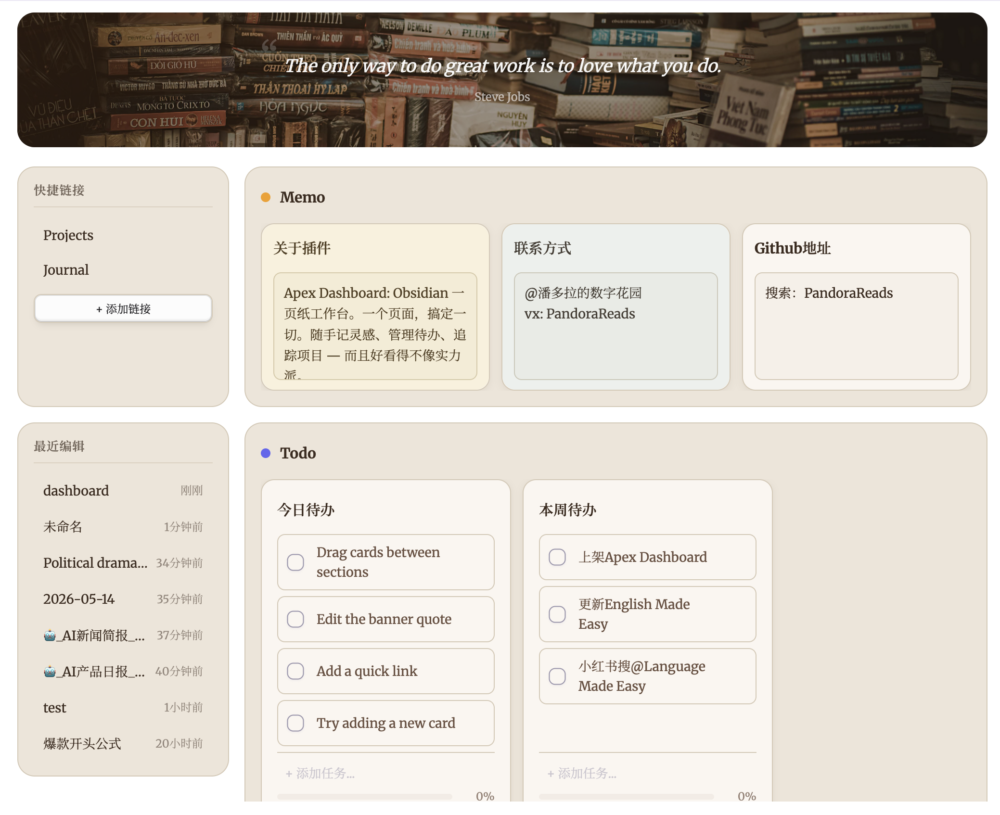

# Peingxious Dashboard

> Obsidian 涓€椤电焊宸ヤ綔鍙般€備竴涓〉闈紝鎼炲畾涓€鍒囥€傞殢鎵嬭鐏垫劅銆佺鐞嗗緟鍔炪€佽拷韪」鐩?鈥?鑰屼笖濂界湅寰椾笉鍍忓疄鍔涙淳銆?

## 鎴浘棰勮



## 鍔熻兘鐗硅壊

### 馃棐锔?Memo锛堝蹇橈級

鍐呯疆渚跨寮?Memo 鍗＄墖锛屾瘡寮犲崱鐗囬兘鏈夊彲缂栬緫鏂囨湰鍖哄煙锛岀敤浜庨殢鏃惰褰曠伒鎰熴€佷細璁瑪璁版垨姣忔棩鍙嶆€濓紝鏃犻渶绂诲紑浠〃鐩樸€傛敮鎸?`[[鍙岄摼]]` 娓叉煋涓哄彲鐐瑰嚮閾炬帴锛岃嚜鍔ㄤ繚瀛橈紝杩樺彲浠ュ湪淇濈暀鍘熸湁 Memo 鍗＄墖鐨勫悓鏃惰浆鎴愬崟鐙枃妗ｏ紝璁╁畠鍙樻垚鎸囧悜鍗曠嫭绗旇鐨勫叆鍙ｃ€?

### 鉁?Todo锛堝緟鍔烇級

浜や簰寮忎换鍔℃竻鍗曪紝鏀寔娣诲姞銆佹嫋鎷芥帓搴忋€佸嬀閫夊畬鎴愩€傚簳閮ㄨ繘搴︽潯浠ョ櫨鍒嗘瘮瀹炴椂鏄剧ず瀹屾垚杩涘害銆傚緟鍔為」鍚屾牱鏀寔 `[[鍙岄摼]]`锛屾柟渚夸氦鍙夊紩鐢ㄣ€?

鍗＄墖鍙充笂瑙掓湁"闅愯棌宸插畬鎴愪换鍔?灏忕溂鐫涙寜閽紙浠呮湰娆′細璇濈敓鏁堬紝涓嶄細鍐欏洖绗旇锛夈€備粠 1.4.6 璧凤紝鍒嗗尯澶存柊澧?褰掓。宸插畬鎴愬崱鐗?鎸夐挳锛屽紑鍚悗鏁村紶浠诲姟鍏ㄩ儴鍕鹃€夊畬鐨勫崱鐗囦細鑷姩闅愯棌锛涙柊寤?Todo / TodoPlus 鍒嗗尯榛樿寮€鍚紝鍙湪鍒嗗尯澶翠竴閿垏鎹€?

### 馃搧 Projects锛堥」鐩級

灏?Vault 鏂囨。缁勭粐涓洪」鐩崱鐗囥€傛瘡寮犲崱鐗囧彲鍏宠仈澶氱瘒绗旇锛屾敮鎸佸皝闈㈠浘鐗囷紙鏀寔鏈湴 Vault 鍥剧墖鍜岀綉缁滃浘鐗囬摼鎺ワ級鍜屽唴鑱旀枃妗ｆ悳绱紝蹇€熸坊鍔犳枃浠躲€傛敮鎸佺鐞嗗绉嶆枃浠剁被鍨嬶紝鍖呮嫭 Markdown 绗旇銆丳DF銆佸浘鐗囥€侀煶棰戝拰瑙嗛銆?

### 馃摑 Notes锛堢瑪璁帮級

绱у噾鐨勫垪琛ㄥ紡鍒嗗尯锛岀敤浜庢暣鐞嗗弬鑰冩枃妗ｅ拰蹇嵎璁块棶鏂囦欢銆傛瘡琛屾渶澶氭樉绀?5 寮犲崱鐗囷紝鏃犲皝闈㈠浘鐗囷紝鏈€澶у寲淇℃伅瀵嗗害銆?

### 馃摎 Library锛堣祫鏂欏簱锛?

鏁版嵁搴撳紡鍒嗗尯锛屾寜 frontmatter 灞炴€ц仛鍚?Vault 绗旇銆傝鍥炬ā寮忔敮鎸?Grid / List / Table / Kanban锛屽彲璁剧疆绛涢€夈€佹帓搴忋€佸垎缁勪緷鎹紝瀹炴椂娓叉煋绗﹀悎鏉′欢鐨勭瑪璁般€傛敮鎸佹棩鏈熻寖鍥寸瓫閫夈€佸鍊煎睘鎬х瓫閫夛紝浠ュ強鎸夎鍥炬ā寮忓畾鍒跺睘鎬ф樉绀哄垪锛堜粎 Table / List锛夈€?

### 鈿?蹇嵎鎿嶄綔

灏嗗父鐢ㄥ揩鎹锋柟寮忓浐瀹氬埌渚ц竟鏍忥紝鏀寔涓ょ鎿嶄綔绫诲瀷锛?*鏂囦欢**閾炬帴鍙墦寮€浠绘剰鏂囨。锛?*鍛戒护**蹇嵎鏂瑰紡鍙Е鍙戜换鎰?Obsidian 鍛戒护銆傚唴缃柊寤烘棩璁板拰鏂板缓绗旇棰勮銆?

### 馃帹 Banner锛堟í骞咃級

鍙嚜瀹氫箟鐨勬í骞呭尯鍩燂紝鏀寔缂栬緫寮曡█鍜?*鍗曞紶**鑳屾櫙鍥剧墖锛堟湰鍦?Vault 鍥剧墖鎴栫綉缁滃浘鐗囬摼鎺ワ紝鍚?`?` / `&` / `#` / unicode 瀛楃鐨?URL 濡?`huaban.com/鈥 涔熷畨鍏級銆傚弻鍑诲嵆鍙紪杈戙€備粠 1.4.8 璧?banner 绠€鍖栦负鍗曞浘锛堣疆鎾凡绉婚櫎锛夛紱浠?1.4.10 璧风鐩?YAML 鐢?`banner:\n  image:` 宓屽褰㈠紡鏀逛负鍗曡鏍囬噺 `banner: "url"`銆?

### 馃攧 鎷栨嫿鎺掑垪

鍦ㄥ垎鍖轰箣闂存嫋鎷藉崱鐗囨潵閲嶆柊缁勭粐宸ヤ綔绌洪棿锛屼篃鍙互鍦?Todo 鍗＄墖鍐呮嫋鎷戒换鍔￠」杩涜鎺掑簭锛岃繕鏀寔鍦?Projects/Notes 鍗＄墖涔嬮棿鎷栨嫿鏂囨。閾炬帴銆?

### 馃З 鑷畾涔夊垎鍖?

鍒涘缓鍒嗗尯鏃跺彲閫夋嫨 6 绉嶅唴缃被鍨?鈥?**Memo**銆?*Todo**銆?*Projects**銆?*Notes**銆?*Library**銆?*TodoPlus** 鈥?姣忕绫诲瀷閮芥湁鐙珛鐨勫竷灞€鍜岃涓恒€傝嚜鐢辩粍鍚堬紝鎵撻€犱笓灞炲伐浣滄祦銆?

### 馃敆 TodoPlus锛堝緟鍔濸lus锛?

涓€绉嶅垎鍖虹被鍨嬶細鎶婂彟涓€绡囩瑪璁伴噷 `## <浜岀骇鏍囬>` 涓嬬殑娓呭崟瀹炴椂闀滃儚鍒?Dashboard 涓娿€傛妸鍗＄墖鎸囧悜 `[[dash002#To-do]]`锛屼华琛ㄧ洏灏变細浠庡師绗旇娓叉煋鏈€鏂版竻鍗曗€斺€斾笉瀛樺湪绗簩浠藉壇鏈紝姘镐笉婕傜Щ銆備粠 1.4.1 璧凤紝**鍗＄墖 UI 涓庢櫘閫?Todo 鍗＄墖瀹屽叏涓€鑷?*锛堝閫夋鍒楄〃銆佹坊鍔犺緭鍏ユ銆佽繘搴︽潯銆侀殣钘忓凡瀹屾垚鐪兼寜閽級锛屼笖鏀寔瀹屾暣鎿嶄綔锛氬嬀閫?/ 娣诲姞 / 鍒犻櫎 / 缂栬緫锛屽叏閮ㄩ€氳繃 `vault.process` 鍐欏洖鍘熺瑪璁板搴旇锛堝彧鍔ㄤ竴琛岋紝鍏朵粬鏍囬/娈佃惤瀹屽叏涓嶅姩锛夈€?.4.3 璧凤紝鍒嗗尯涓殑 `+` 鎸夐挳鍞よ捣 vault 鍏ㄥ眬绗旇鎼滅储寮圭獥锛氶€変竴鏉＄瑪璁帮紝鑻ュ師绗旇閲屾病鏈?`## To-do` 鏍囬锛屾彃浠朵細鑷姩杩藉姞涓€涓┖鏍囬鍧楄浣犵珛鍗冲紑濮嬪啓浠诲姟銆?.4.6 璧凤紝鍒嗗尯澶寸殑褰掓。鎸夐挳锛堥粯璁ゅ紑鍚級浼氳嚜鍔ㄩ殣钘忔簮娓呭崟宸插叏閮ㄥ嬀閫夊畬鐨?TodoPlus 鍗＄墖銆?

### 馃晲 鏈€杩戞枃妗?

渚ц竟鏍忓睍绀烘渶杩戠紪杈戠殑鏂囦欢鍙婄浉瀵规椂闂达紝蹇€熷洖鍒版渶杩戠殑宸ヤ綔銆?

### 鈴?浠诲姟鎻愰啋

涓轰换鎰忎换鍔¤缃彁閱掓椂闂淬€傜偣鍑讳换鍔℃梺鐨勯搩閾涘浘鏍囷紝寮瑰嚭鍙鍖栨棩鍘嗛€夋嫨鍣紙鏀寔缈绘湀銆佺偣閫夋棩鏈熴€佸皬鏃跺拰鍒嗛挓涓嬫媺锛夈€傛彁閱掍互 `鈴?YYYY-MM-DD HH:MM` 鍐呰仈鏍煎紡瀛樺偍鍦?Markdown 涓紝鍙洿鎺ュ湪绗旇涓煡鐪嬪拰缂栬緫銆?0 绉掑畾鏃舵鏌ワ紝浠诲姟鍒版湡鏃跺脊鍑?Obsidian Notice 閫氱煡锛涜繃鏈熶换鍔＄殑閾冮摏鍥炬爣鍙樼孩骞跺甫鑴夊啿鍔ㄧ敾銆?

### 馃К 绗旇 鈫?浠〃鐩?涓€閿浆鎹?

閫氳繃鍛戒护闈㈡澘鎶婁换鎰?Markdown 绗旇涓€閿浆鎹负浠〃鐩樸€傛彃浠舵壂鎻忕瑪璁扮殑 `## H2` 鏍囬锛堣嚜鍔ㄨ烦杩囪嚜寮曠敤鏍囬锛夛紝鍐欏叆鏂囦欢 frontmatter 鐨?`columns:` 瀛楁锛岀劧鍚庢墦寮€瀵瑰簲绗旇鐨勪华琛ㄧ洏瑕嗙洊灞傘€傚彟鏈変竴鏉″弽鍚戝懡浠わ紝鍙妸浠〃鐩?frontmatter 绉婚櫎銆佽繕鍘熶负鏅€氱瑪璁般€?

### 馃搼 宓屽叆绗旇 Tab

鎶婁换鎰忓叾浠栫瑪璁颁互 tab 褰㈠紡宓屽叆鍒颁富宸ヤ綔鍙颁腑銆傝宓屽叆绗旇鐨?`## H2` 鏍囬浼氭垚涓哄瓙 tab 鍐呯殑鍒楋紝鏂逛究鍦ㄥ涓?宸蹭华琛ㄧ洏鍖?鐨勭瑪璁颁箣闂存潵鍥炲垏鎹€傚鑸爮鏈変笓鐢ㄧ殑鎵撳紑 / 鍏抽棴閫夋嫨鍣紙鍚矾寰勬帓闄よ繃婊わ級銆?

### 鈫╋笍 鎾ら攢锛圕trl/Cmd+Z锛?

鍦ㄥ伐浣滃彴涓寜 `Ctrl+Z`锛坢acOS 涓?`Cmd+Z`锛夊嵆鍙仮澶嶆渶杩戜竴娆¤鍒犻櫎鐨勫崱鐗囥€乼odo 浠诲姟銆侀」鐩」鎴栧垎鍖恒€傛渶澶氫繚鐣?50 鏉″垹闄よ褰曘€傚悓涓€鍔ㄤ綔浠ャ€屾挙閿€鏈€杩戜竴娆″垹闄ゃ€嶅嚭鐜板湪鍛戒护闈㈡澘涓紝褰撴挙閿€鏍堜负绌烘椂鑷姩浠庨潰鏉夸腑闅愯棌銆?

## 涓婚

Dashboard 鑷姩璺熼殢 Obsidian 鍘熺敓涓婚鑹诧紝瀹岀編閫傞厤鎵€鏈夌ぞ鍖轰富棰樼殑浜壊鍜屾殫鑹叉ā寮忥紝鏃犻渶棰濆閰嶇疆銆傚悓鏃跺唴缃牱寮忛璁鹃€夋嫨鍣紙Earth / Nordic / Aurora / Spring / Island / Tundra / Blossom / Haze / Ember / Jade / Matcha / Lilac / Eclipse锛夛紝鍙攣瀹氱壒瀹氶鏍硷紝鎴栦繚鎸?Auto 鑷姩璺熼殢褰撳墠 Obsidian 涓婚銆?

## 鍛戒护闈㈡澘

| 鍛戒护 ID                       | 鍚嶇О                       | 榛樿蹇嵎閿?          |
| ----------------------------- | -------------------------- | -------------------- |
| `open-dashboard`              | 鎵撳紑宸ヤ綔鍙?                | 鈥?                   |
| `toggle-dashboard-sidebar`    | 鍒囨崲宸ヤ綔鍙颁晶杈规爮           | 鈥?                   |
| `convert-note-to-dashboard`   | 灏嗙瑪璁拌浆鎹负浠〃鐩?        | 鈥?                   |
| `restore-note-from-dashboard` | 浠庝华琛ㄧ洏鎭㈠绗旇           | 鈥?                   |
| `embed-note-in-dashboard`     | 鍦ㄥ伐浣滃彴涓祵鍏ョ瑪璁?        | `Ctrl+Alt+D`         |
| 锛堝唴缃級                      | 鎾ら攢鏈€杩戜竴娆″垹闄?          | `Ctrl+Z` / `Cmd+Z`   |

## 璁剧疆閫夐」

- **Dashboard 鏂囦欢璺緞** 鈥?鑷畾涔変华琛ㄧ洏鏁版嵁鏂囦欢鐨勫瓨鏀捐矾寰?
- **鏍峰紡棰勮** 鈥?閫夋嫨鍐呯疆椋庢牸锛圗arth / Nordic / Aurora / Spring / Island / Tundra / Blossom / Haze / Ember / Jade / Matcha / Lilac / Eclipse锛夛紝鎴栦繚鎸?Auto 璺熼殢 Obsidian 涓婚
- **璇█** 鈥?鏀寔鑻辨枃鍜屼腑鏂囩晫闈?
- **鏈€杩戞枃妗ｆ暟閲?* 鈥?鎺у埗渚ц竟鏍忔樉绀虹殑鏈€杩戞枃浠舵暟閲?
- **榛樿閽変綇渚ц竟鏍?* 鈥?鎵撳紑宸ヤ綔鍙版椂锛屽彸渚ц竟鏍忓缁堜繚鎸佸睍寮€鐘舵€?
- **闅愯棌椤圭洰宓屽鏂囨。** 鈥?椤圭洰鍗＄墖涓粎鏄剧ず椤跺眰鏂囨。锛屽瓙鏂囨。闅愯棌浣嗕繚鐣欐暟鎹?
- **Todo 榛樿闅愯棌宸插畬鎴愪换鍔?* _锛堥粯璁わ細寮€锛塤 鈥?鍏ㄥ眬榛樿锛涘崱鐗囩溂鐫涙寜閽彲涓存椂瑕嗙洊鍗曞崱鐗囷紙浠呬細璇濆唴鐢熸晥锛屼笉鍐欏叆绗旇锛?
- **Todo / TodoPlus 鍒嗗尯鑷姩褰掓。宸插畬鎴愬崱鐗?* _锛堥粯璁わ細姣忓垎鍖哄紑鍚級_ 鈥?鎺у埗鍒嗗尯澶寸殑褰掓。鎸夐挳锛涘紑鍚悗鏁村紶鍗＄墖浠诲姟鍏ㄩ儴鍕鹃€夊畬姣曠殑鍗＄墖浼氫粠浠〃鐩橀殣钘?
- **鎺掗櫎鐨勭瑪璁?* 鈥?鍦ㄣ€屾墦寮€銆嶉潰鏉夸腑闅愯棌鐨勭瑪璁板悕绉版垨璺緞锛岄€楀彿鍒嗛殧锛堝 `dashboard, area/workbench`锛夈€備富宸ヤ綔鍙版枃浠堕粯璁ゆ帓闄?
- **渚ц竟鏍忓皬缁勪欢** 鈥?澶╂皵 / 鐑姏鍥?/ 鐣寗閽?/ 闃呰 / 鍊掕鏃?/ 鍐滃巻锛屽彲鐙珛寮€鍏充笌閰嶇疆
- **闃呰璁剧疆** 鈥?寮€鍏抽槄璇昏拷韪€佹槸鍚﹀惎鐢ㄤ細璇濆畬鎴愰煶鏁?

## 瀹夎

### 浠?Obsidian 绀惧尯鎻掍欢甯傚満瀹夎

1. 鎵撳紑 璁剧疆 > 绗笁鏂规彃浠?
2. 娴忚骞舵悳绱?"Peingxious Dashboard"
3. 鐐瑰嚮瀹夎锛岀劧鍚庡惎鐢?

### 鎵嬪姩瀹夎

1. 浠?[GitHub Releases](https://github.com/pandorareads/peingxious-dashboard/releases) 涓嬭浇鏈€鏂扮増鏈?
2. 瑙ｅ帇鍒?Vault 鐨?`.obsidian/plugins/peingxious-dashboard/` 鐩綍
3. 鎵撳紑 璁剧疆 > 绗笁鏂规彃浠讹紝鍚敤 "Peingxious Dashboard"

## 浣跨敤鏂规硶

1. 閫氳繃宸︿晶鍔熻兘鍖哄浘鏍囷紙涓婚〉鍥炬爣锛夋垨鍛戒护闈㈡澘鎵撳紑锛歚Peingxious Dashboard: Open dashboard`
2. 棣栨浣跨敤浼氬湪 Vault 鏍圭洰褰曡嚜鍔ㄥ垱寤?`dashboard.md` 鏂囦欢
3. 鎵€鏈夋洿鏀圭洿鎺ヤ繚瀛樺埌鏂囦欢 鈥?绾枃鏈牸寮忥紝浣犵殑鏁版嵁瀹屽叏灞炰簬浣?

### 鏂囦欢鏍煎紡

Dashboard 浣跨敤缂╄繘 bullet 鍒楄〃鏍煎紡缁勭粐鏁版嵁锛?

```markdown
---
columns:
  - name: "Memo"
  - name: "Todo"
  - name: "Projects"
---

## Memo

- 2026-06-08 澶囧繕
  - 娆㈣繋浣跨敤 Peingxious Dashboard锛佺偣鍑绘澶勭紪杈戜綘鐨勭涓€鏉″蹇樸€?

## Todo

- 寰呭姙娓呭崟
  - [ ] Review dashboard plugin code
  - [ ] Write documentation
  - due: 2025-05-20

## Projects

- Obsidian Dashboard
  - [[obsidian-dashboard/README.md]]
  - progress: 60
```

- `---` frontmatter 瀹氫箟鍒嗗尯鍒楋紙鍙檮 `archiveCompleted: true|false` 绛夊垪绾ч厤缃級
- `##` 鏍囬瀹氫箟鍒嗗尯姝ｆ枃
- 椤剁骇 `-` 瀹氫箟鍗＄墖鏍囬
- 缂╄繘鐨?`\t-` 瀹氫箟鍗＄墖鍐呭锛堟枃鏈€佷换鍔°€佸厓鏁版嵁绛夛級
- 浠诲姟浣跨敤 `- [ ]` / `- [x]` 鏍煎紡
- 鍏冩暟鎹娇鐢?`key: value` 鏍煎紡锛堝 `due:`銆乣progress:`銆乣link:`锛?

> **鎻愮ず锛?* 姣忎釜鍒嗗尯鏍囬鍙充晶鏈夊瀮鍦炬《鎸夐挳锛屽彲鐩存帴鍦?Dashboard 鐣岄潰涓垹闄ゅ垎鍖恒€?

## 鏇存柊鏃ュ織

### 1.5.1 (2026-06-27)

- **鍒嗗尯澶撮儴鎸夐挳鐜板湪濮嬬粺鍙** 鈥 绫诲瀷鍒囨崲涓嬫媺鎸夐挳銆佹坊鍔犳寜閽€佸垹闄ゆ寜閽粯璁や笉鍐嶉殣钘忥紝涔嬪墠浠呭湪 hover 鍒嗗尯澶撮儴鏃舵墠鏄剧ず
- **蹇嵎鎿嶄綔鎸夐挳鐜板湪濮嬬粓鍙** 鈥 閽変綇鎸夐挳鍜屾坊鍔犳寜閽粯璁や笉鍐嶉殣钘
- **蹇嵎鎿嶄綔鍥炬爣灏哄澧炲ぇ** 鈥 浠?12px 澧炲姞鍒?18px锛屾洿娓呮櫚鍙

### 1.4.12 (2026-06-25)

- **Memo 鍗＄墖鍦ㄤ富椤甸潰鏉垮彲鏇村彲闈犲湴鑷姩淇濆瓨** 鈥?杈撳叆鏃惰繘琛岄槻鎶ф€с€佸欢杩熶繚瀛樸€傚苟鍦?blur 鏃跺甫閿欒鎻愮ず锛岄伩鍏嶄富椤甸潰蹇呴』瀹屽叏鍒囨崲鐒跺悗鎵嶈兘鍐欏洖 `dashboard.md`
- **Memo "杞垚绗旇" 鏍规嵁鍘熷唴瀹硅繘琛屽疄闄呯Щ鍔?** 鈥?褰撳墠 Memo 鍐呭浼氳鎷疯礉鍒版柊鍒涘缓鐨勬枃妗ｄ腑锛岃€屽師 Memo 鍗＄墖鍙湁涓€涓?`[[鏂扮瑪璁?]]` 閾炬帴锛岃浠〃鐩樹繚鎸佷负鎸囧悜鍗曠嫭绗旇鐨勫叆鍙ｃ€?

### 1.4.11 (2026-06-23)

- **绉婚櫎 `.dashboard-backup` 鑷姩澶囦唤** 鈥?`SyncEngine` 涓嶅啀鍦ㄨ鐩?dashboard 鏂囦欢鍓嶅悜 `.dashboard-backup/dashboard-<timestamp>.md` 鍐欏叆蹇収銆俙BACKUP_DIR` / `MAX_BACKUPS` 甯搁噺涓庢暣涓?`createBackup()` 鏂规硶宸插垹闄ゃ€侱ashboard 鐨勭湡瀹炴暟鎹簮鐜板湪**涓ユ牸**鍙湁閭ｄ竴浠?dashboard markdown鈥斺€攙ault 涓笉鍐嶄繚鐣欏苟琛屽壇鏈€傚簲鐢ㄥ唴鐨?`Ctrl/Cmd+Z` 鎾ら攢鏍?*淇濇寔涓嶅彉**锛屼粛鏄牬鍧忔€ф搷浣滅殑鎭㈠閫斿緞銆傛敞鎰忥細鏃х増鏈仐鐣欑殑 `.dashboard-backup/` 鐩綍浠嶄細鐣欏湪 vault 涓紝闇€鎵嬪姩鍒犻櫎锛堜竴娆℃€ф竻鐞嗭紝鎻掍欢涓嶅啀浜х敓鏂版枃浠讹級

### 1.4.10 (2026-06-16)

- **banner frontmatter 绠€鍖栦负鍗曡鏍囬噺** 鈥?鍐欏叆鐢?`banner:\n  image: "url"` 宓屽褰㈠紡鏀逛负 `banner: "url"`銆傛枃浠舵洿骞插噣锛岃涓轰笉鍙橈細鏃ф枃浠剁収甯稿姞杞斤紝URL 鐢?`"` 寮曞彿鍖呰９浠ュ吋瀹?`?` / `&` / `#` / unicode锛堝 `huaban.com/鈥?lmNOvW`锛夌瓑 YAML plain-string 瀹规槗鍑洪棶棰樼殑瀛楃
- **banner 鍙敮鎸佸崟鍥?* 鈥?澶氬浘 `images: []` 鍐欏叆鍒嗘敮鍒犻櫎銆俙banner.images` 璇诲彇鏃朵粛淇濈暀鍏煎鏃ф枃浠讹紝浣嗘彃浠舵案杩滀笉浼氬啓鍑烘潵銆傛寜鐢ㄦ埛瑕佹眰锛?鍥剧墖鍙兘鏈変竴寮狅紝涓嶆槸澶氬紶鐨?
- **鍒囨崲鍒嗗尯绫诲瀷涓嶅啀鐮村潖鐢ㄦ埛鍐呭** 鈥?`migrateCardsForSectionType` 涓嶅啀娓呯┖ `card.tasks`锛岃€屾槸鎶婃瘡鏉′换鍔¤浆涓?body 琛屽苟淇濈暀鍘熸湁 body銆俙todo 鈫?projects` 鍒囨崲淇濈暀浠诲姟鏂囨湰锛堟寜鐢ㄦ埛"鍘绘帀 [ ] 灏卞彲浠ヤ簡"鐨勮鍒欏幓鎺夊閫夋锛夛紝`projects 鈫?todo` 鍒囨崲浠?body 閲嶆柊鏋勫缓 `card.tasks` 骞朵繚鐣?`- ` 鍓嶇紑浠ヤ究鍥炵幆銆傛暟鎹湪鍥涚鍒嗗尯绫诲瀷浠绘剰 (from 脳 to) 鍒囨崲涓弗鏍间繚鐣?
- **Library 鍒嗗尯鍥涚瑙嗗浘閮芥敮鎸佸彸閿枃浠惰彍鍗?* 鈥?Grid銆丩ist銆並anban 鍗＄墖锛堝惈 Kanban 鐨?鏈垎缁?鍒楋級鐜板湪閮戒細瑙﹀彂涓?Table 瑙嗗浘"鏂囦欢鍚?鍒楀悓鏍风殑 `showFileContextMenu`锛歄pen in new tab / pane / window銆丆opy `[[wikilink]]`銆丆opy Obsidian URL銆丷eveal in file explorer锛屼互鍙婁换浣?hook 浜?`file-menu` 浜嬩欢鐨勭涓夋柟鎻掍欢銆俆able 瑙嗗浘鐨勭洃鍚櫒浠?name 鍒椾笂绉诲埌鏁磋 `tr`锛屾墍浠ュ彸閿?frontmatter 鍊煎垪锛坉blclick 瑙﹀彂鐨勫彲缂栬緫鍒楋級涔熶細寮瑰嚭鑿滃崟鈥斺€擿contextmenu` 鍜?`dblclick` 鏄笉鍚岄紶鏍囧姩浣滐紝鏃犲啿绐?
- **娴嬭瘯** 鈥?`tests/migration.test.mjs`锛? 涓敤渚嬶級銆乣tests/banner.test.mjs`锛? 涓敤渚嬶級宸插姞鍏?`tests/`

### 1.4.9 (2026-06-15)

- **BUG-003a 路 鍒囨崲鍒嗗尯绫诲瀷鏃跺伐浣滃彴鍚屽抚鍒锋柊** 鈥?鏂板 [`SyncEngine.updateFrontmatterField()`](file:///d:/BaiduNetdiskWorkspace/test/.obsidian/plugins/apex-dashboard/src/sync.ts#L1543) + [`updateColumnsField()`](file:///d:/BaiduNetdiskWorkspace/test/.obsidian/plugins/apex-dashboard/src/sync.ts#L1605) 鍏紑鏂规硶锛氳蛋 `app.fileManager.processFrontMatter()` API 鐩存帴 mutate `columns:` 瀛楁銆俙setColumnSectionType` / `setColumnArchiveCompleted` 鏀硅蛋**鏂拌矾寰?*锛岃皟鐢ㄥ墠鍚屾瑙﹀彂 `notifyCallbacks` 鈫?`view.requestRender(newData)`锛?*鍚屽抚**鍙嶆槧鏂扮被鍨嬨€俙view.ts:onColumnSectionTypeChange` callback 棰濆**寮哄埗**鍐?requestRender 涓€娆★紙闃插尽鎬э細瑕嗙洊 RAF 鍚堝苟鍙兘鍚炴帀璇锋眰鐨勬儏鍐碉級銆備慨澶嶆棫璺緞涓嬬敤鎴烽渶鍒囪蛋 tab 鍐嶅垏鍥炴墠鑳界湅鍒版柊鏍峰紡鐨勪綋楠?
- **BUG-003b 路 banner 鍧楁潯浠惰緭鍑猴紝鏈搷浣滀笉鍐嶅啓** 鈥?`parser.ts:serialize` 鍒犻櫎纭紪鐮?`lines.push("banner:")`锛屾敼涓?*浠呭綋** `data.banner.image` 闈炵┖鏃舵墠杈撳嚭 `banner:` 鍧椼€傜敤鎴蜂粠鏈紪杈戣繃 banner 鈫?鏂囦欢**涓嶅惈** `banner:` 瀛楁锛涚紪杈戣繃 banner锛堝～ URL锛夆啋 鏂囦欢**淇濈暀** `banner:` 鍧楋紱娓呯┖ banner锛堣 image 涓?""锛夆啋 鏃?banner 鍧椾細鍦ㄤ笅娆′繚瀛樻椂**鑷姩浠庢枃浠剁Щ闄?*锛堢敱 `serializeInto` 鈫?`patchYamlBlock` 鐨?null block 璺緞澶勭悊锛夈€俙parseBanner` 琛屼负涓嶅彉锛屽悜鍚庡吋瀹瑰凡鏈?`banner:` 鍧楃殑鑰佹枃浠?
- **BUG-003c 路 榛樿鍙帶鍒?columns锛屽叾瀹冨瓧娈靛瓧鑺傜骇涓嶅姩** 鈥?鍒囨崲鍒嗗尯绫诲瀷鏃?*涓嶅啀**鏁存枃浠堕噸鍐欍€俠anner / quickActions / extra frontmatter / YAML 娉ㄩ噴 / 绌鸿椤哄簭**瀹屽叏淇濈暀**銆傛柊璺緞鍙姩 `columns:` 瀛楁锛屽叾瀹冨瓧娈?byte-identical銆俙writeToDisk` 鏁存枃浠惰矾寰?*淇濈暀**锛屼緵鍗＄墖澧炲垹鏀广€乥anner 缂栬緫銆乹uickActions 澧炲垹绛夊満鏅娇鐢ㄣ€傚啓瀹屽悗 `console.error` + `new Notice("Failed to save dashboard changes")` 鍏滃簳锛岄敊璇笉鍐嶉潤榛?

### 1.4.8 (2026-06-15)

- **BUG-001 路 Banner 绠€鍖栦负鍗曞浘锛屽脊绐楀彧鏈夊浘鐗囧湴鍧€** 鈥?**鍒犻櫎** banner 缂栬緫寮圭獥閲岀殑 "Rotation Images" 鍒楄〃涓?"Add Image" 鎸夐挳鈥斺€攂anner 涓嶅啀鏀寔杞挱銆傚脊绐?*鍙?*淇濈暀涓€涓浘鐗囧湴鍧€杈撳叆妗嗭紙vault 鐩稿璺緞鎴栧畬鏁?https URL锛夈€俙view.ts:setupBannerRotation` 鏁存鍒犻櫎锛宍images.length > 1` 涓嶅啀瑕嗙洊涓诲浘銆俙parser.ts:serialize` 涓嶅啀杈撳嚭 `banner.images:` 鍧楋紱`banner.images` 鏁版嵁璇绘椂**蹇界暐**锛堝悜鍚庡吋瀹规棫鏂囦欢锛夈€傝ˉ鍏?`i18n.ts` 缂哄け鐨?7 涓?banner key锛坄banner.edit` / `banner.image` / `banner.imageDesc` / `banner.imagePlaceholder` / `banner.rotationImages` / `banner.addImage` / `banner.save`锛夛紝寮圭獥 label / placeholder 姝ｅ父鏄剧ず
- **BUG-002 路 棣栨鎵撳紑宸ヤ綔鍙颁笉鍐嶆敞鍏ラ粯璁ゅ垎鍖?* 鈥?鏂板 `generateEmptyDashboardMarkdown()`锛坄parser.ts:600`锛夆€斺€旇緭鍑?*浠?*鍚渶灏?frontmatter + `columns: []` 鐨勯鏋躲€俙sync.ts:findOrCreateFile` 鍦ㄦ柊寤烘枃浠舵椂鏀圭敤 `generateEmptyDashboardMarkdown()`锛堟浛浠?`generateDefaultMarkdown()`锛夈€俙parser.ts:parseColumnDefs` 鍦?`columns:` 缂哄け鏃?*杩斿洖 `[]`**锛屼笉鍐?fallback 鍒?`DEFAULT_COLUMNS`銆俙DEFAULT_COLUMNS` / `generateDefaultMarkdown` 淇濈暀骞舵爣璁?`@deprecated`锛屼粎渚涙湭鏉?鎻掑叆绀轰緥鏁版嵁"鎸夐挳浣跨敤銆傜敤鎴锋竻绌?`dashboard.md` 鐨?`columns:` 鍧楀悗鍐嶆墦寮€ 鈫?宸ヤ綔鍙?*绌?*锛屾枃浠?*涓嶈鏀瑰洖**

### 1.4.7 (2026-06-15)

- **鏂囨。鍚屾** 鈥?README / README_ZH / versions.json 鍏ㄩ潰瀵归綈 v1.4.0 鈫?v1.4.6 changelog銆?.4.1 涔嬪悗鍙戝竷鐨勬墍鏈夌壒鎬э紙TodoPlus 鍗＄墖 UI 涓?Todo 瀵归綈銆? 鎸夐挳鍞よ捣绗旇鎼滅储寮圭獥銆佸垎鍖虹骇鑷姩褰掓。鍒囨崲锛夐兘宸插湪鍔熻兘绔犺妭涓灏芥弿杩般€?*鏃犱换浣曚唬鐮佸彉鏇?*

### 1.4.6 (2026-06-14)

- **鍒嗗尯绾?褰掓。宸插畬鎴愬崱鐗?鎸夐挳锛圱odo / TodoPlus锛?* 鈥?鍙栦唬 1.4.5 鐨?闅愯棌宸插畬鎴愪换鍔?璇箟銆傚紑鍚紙鏂板缓 / 宸插瓨鍦ㄥ垎鍖洪粯璁ゅ紑锛夋椂锛屾暣寮犲崱鐗囦换鍔″叏閮ㄥ嬀閫夊畬鐨勫崱鐗囦細浠庝华琛ㄧ洏闅愯棌锛涘叧闂椂鍏ㄩ儴鏄剧ず銆傛柊鎸夐挳閲囩敤 `archive` / `archive-restore` lucide 鍥炬爣銆傚垎鍖?frontmatter 瀛楁閲嶅懡鍚嶄负 `archiveCompleted: true|false`锛堟浛鎹?`hideCompleted`锛?.4.5 鏂囦欢涓嬫淇濆瓨鏃惰嚜鍔ㄨ縼绉伙級
- **绌哄垎鍖哄崰浣?* 鈥?褰撳垎鍖哄唴鎵€鏈夊崱鐗囬兘宸插綊妗ｆ椂锛屾樉绀轰竴琛屾贰鑹?`銆屾墍鏈夊崱鐗囬兘宸插綊妗ｂ€︺€峘 鎻愮ず锛岄伩鍏嶈浠ヤ负鍒嗗尯绌轰簡
- **TodoPlus 褰掓。鍒ゅ畾瀹炴椂璇诲彇婧愮瑪璁?* 鈥?閫氳繃鐜版湁 `resolveTodoPlusSlice` 杈呭姪鍑芥暟瑙ｆ瀽婧愭枃浠舵爣棰樺潡锛屽綊妗ｅ喅绛栧弽鏄犳簮绗旇鐨勫疄鏃剁姸鎬侊紝鑰岄潪闄堟棫鐨勯暅鍍?
- **绉婚櫎 1.4.5 鐨勫垎鍖虹骇"闅愯棌宸插畬鎴愪换鍔?瑕嗙洊閫昏緫** 鈥?鍗曞崱鐗囩溂鎸夐挳锛堜粎浼氳瘽鍐呫€佷粎鍐呭瓨锛夋槸鍞竴鐨勯」绾ц繃婊ゅ櫒

### 1.4.5 (2026-06-14)

- **鍒嗗尯绾?鏄剧ず / 闅愯棌鍏ㄩ儴宸插畬鎴愪换鍔?寮€鍏筹紙Todo / TodoPlus锛?* 鈥?鍒嗗尯澶寸殑鐪肩潧鎸夐挳锛屽啓鍏ュ垪鐨?frontmatter `hideCompleted: true|false`锛岃法鍒锋柊淇濈暀銆傝В鏋愪紭鍏堢骇锛堟渶鍏蜂綋浼樺厛锛夛細`card.hideCompleted`锛堜粎浼氳瘽锛夆啋 `column.hideCompleted`锛堟湰娆℃柊澧烇級鈫?`settings.defaultHideCompleted`锛堝叏灞€锛夈€傜涓夋鐐瑰嚮鍒嗗尯鐪兼寜閽細鍐欏叆 `undefined`锛堣嚜鍔ㄤ粠鏂囦欢鍒犻櫎璇ヨ锛?
- **淇 TodoPlus 娣诲姞椤瑰垏鐗囨紓绉?* 鈥?涔嬪墠姣忔鏂板浠诲姟鏃剁敱浜庡垏鐗囨湯灏剧┖琛屾湭鍘婚櫎锛屾枃浠朵細閫愭鍚戝彸鍋忕Щ涓€涓┖琛岋紱鏂板鍓嶅厛鍊掑簭鍘婚櫎灏鹃儴绌鸿锛屾柊琛岀揣璐翠笂涓€琛?
- **淇 TodoPlus 棣栨鑷姩杩藉姞鏍囬鐨勫浣欑┖琛?* 鈥?褰撴墍閫夋簮绗旇杩樻病鏈?`## To-do` 鏍囬鏃讹紝鏂拌拷鍔犵殑鏍囬鍧楃幇鍦ㄧ揣璐存鏂囷紙浠呬竴涓?`\n` 鍒嗛殧锛?
- **"鏂板鍒嗗尯"涓嬫媺鎶?`Todo` 绱ч偦 `TodoPlus`** 鈥?椤哄簭鐢?`Notes / Todo / Memo / Library / Todoplus` 璋冩暣涓?`Notes / Todo / Todoplus / Memo / Library`

### 1.4.4 (2026-06-14)

- **淇 TodoPlus 鏂板缓鍗＄墖鏍囬鍙岄噸 `[[ ]]` 鍖呰９** 鈥?`addTodoPlusCardFromNote` 鐜扮洿鎺ヤ娇鐢?`file.basename`锛圱File 鐨?`.basename` 宸茬粡鏄幓闄?`.md` 鍚庣殑锛夛紝鏂板崱鐗囨爣棰?`[[dash03#To-do]]` 涓嶅啀鏄洓灞傛嫭鍙枫€傚崱鐗囨爣棰樼幇鍦ㄤ笌鍗曞崱瑙ｆ瀽鍣?`getTodoPlusSourceLinkFromTitle` 鐨勫绾︿竴鑷?
- **浠?鏂板鍒嗗尯"閫夋嫨鍣ㄧЩ闄?`绗旇 (鏃犲皝闈?`** 鈥?瀹冩槸 `Notes` 鐨勯仐鐣欏埆鍚嶏紝鏃犵嫭绔嬪浘鏍?/ 鏍峰紡銆傚凡瀛樺湪鐨?`notes` 鍒嗗尯鐓у父瑙ｆ瀽 / 娓叉煋 / 搴忓垪鍖栵紝浠?鏂板缓"鍏ュ彛娑堝け
- **娓呯悊鏃犵敤 `pathToWikiLink` 瀵煎叆鍜?`typeNotesPlain` i18n 閿?*

### 1.4.3 (2026-06-14)

- **TodoPlus 鍒嗗尯 `+` 鎸夐挳鏀逛负绗旇鎼滅储寮圭獥** 鈥?鏇夸唬鍘熸湰鐨勫唴鑱?wikilink 杈撳叆妗嗭紙瑕佹眰鎵嬭緭 `dash002#To-do` / `[[dash002#To-do]]` / `dash002` 绛夊瓧绗︿覆骞舵牎楠岋級銆傛柊娴佺▼锛氱偣鍑?`+` 鈫?寮瑰嚭 `DocSearchModal`锛堜笌 Project 鍏辩敤锛屽瓙涓茶繃婊わ紝鏈€澶?20 鏉★紝閿叆瀹炴椂鍒锋柊锛夆啋 閫変腑涓€鏉＄瑪璁?鈫?寮圭獥鍏抽棴 鈫?鏂板涓€寮?`[[note#To-do]]` 闀滃儚鍗°€傝嫢鎵€閫夌瑪璁伴噷杩樻病鏈?`## To-do` 鏍囬锛屾彃浠堕€氳繃 `vault.process` 鑷姩杩藉姞涓€涓?

### 1.4.2 (2026-06-14)

- **绉婚櫎 TodoPlus 鍗＄墖涓婄殑鍐椾綑鍏冩暟鎹?* 鈥?鍗＄墖姝ｆ枃鐜颁粎涓€琛?`- [[dash002#To-do]]` 鍔犵缉杩涚殑鍏冩暟鎹紙cover / width / size / grid锛夈€?.4.0 / 1.4.1 鍐欏叆鐨?`type: todoplus` 涓?`sourceLink: "[[...]]"` 琛屼笉鍐嶅啓鐩橈紙鍒嗗尯 frontmatter 鐨?`sectionType: todoplus` 鍜屽崱鐗囨爣棰樼殑 wikilink 鍒嗗埆鏄繖涓よ€呯殑鍞竴鐪熷疄鏉ユ簮锛?
- **鍒犻櫎 `DashboardCard.sourceLink` 瀛楁** 鈥?娓叉煋鍣ㄩ€氳繃鏂拌緟鍔╁嚱鏁?`getTodoPlusSourceLinkFromTitle(card)` 浠庡崱鐗囨爣棰樿鍙栨簮閾炬帴
- **`onCardAdd` 閫夐」 shape 鍙樻洿** 鈥?`options.sourceLink` 鏀逛负 `options.title`銆俆odoPlus 鍒嗗尯璋冪敤鏂圭洿鎺ヤ紶鍏?wikilink 褰㈠紡鐨勬爣棰?`[[note#heading]]`

### 1.4.1 (2026-06-14)

- **TodoPlus 鍗＄墖 UI 涓庢搷浣滃畬鍏ㄥ榻愭櫘閫?Todo 鍗＄墖** 鈥?1.4.0 鐨?Source: [[鈥]"澶翠笌"## 鏍囬"鎻愮ず琛屽叏閮ㄧЩ闄わ紱鍗＄墖 DOM 澶嶇敤 `dashboard-task-list` / `dashboard-task-item` / `dashboard-task-add` / `dashboard-progress`锛岃倝鐪间笂涓庢櫘閫?Todo 鍗＄墖瀹屽叏涓€鑷淬€傚崱鐗囧彸涓婅鐨勯殣钘忓凡瀹屾垚鐪兼寜閽湪 TodoPlus 鍗＄墖涓婂悓鏍风敓鏁?
- **涓変釜鏂?`vault.process` 鍐欏洖杈呭姪鍑芥暟** 鈥?`addTodoPlusItem` / `removeTodoPlusItem` / `editTodoPlusItem`锛屽垎鍒鐞嗘柊澧?/ 鍒犻櫎 / 鏂囨湰缂栬緫锛涢兘鍙姩 `## <heading>` 鍒囩墖鍐呯殑瀛楄妭
- **鍗＄墖 `title` 鑷姩璁剧疆涓?wikilink** 鈥?鏂板缓鎴栦慨鏀规簮閾炬帴鏃讹紝鍗＄墖棣栨潯 bullet 鐨勬爣棰樿嚜鍔ㄥ啓涓?`[[note#heading]]`锛屼笌 sourceLink 淇濇寔涓€鑷?

### 1.4.0 (2026-06-14)

- **鏂板鍒嗗尯绫诲瀷锛歍odoPlus锛堝緟鍔濸lus锛?* 鈥?鎶婂彟涓€绡囩瑪璁伴噷 `## <浜岀骇鏍囬>` 涓嬬殑娓呭崟瀹炴椂闀滃儚鍒?Dashboard 涓娿€傚崱鐗囨寚鍚?`[[dash002#To-do]]`锛屼华琛ㄧ洏灏辨覆鏌撹鍘熺瑪璁扮殑娓呭崟
- **鍙屽悜鍚屾** 鈥?鍕鹃€夊閫夋閫氳繃 `vault.process` 鏀瑰啓鍘熺瑪璁板搴旇锛堝彧鍔ㄤ竴琛岋級
- **瀹屽叏浣跨敤 Obsidian 鍘熺敓 API 璇诲彇** 鈥?浠呬緷璧?`metadataCache.getFirstLinkpathDest` + `metadataCache.getFileCache(file).headings` + `vault.cachedRead`锛屾棤鏂版寔涔呭寲灞?
- **鍒嗗尯绫诲瀷涓嬫媺 / 鏂板鍒嗗尯閫夋嫨鍣ㄥ潎鍔犲叆 `寰呭姙Plus`** 鈥?`list-checks` 鍥炬爣
- **Wikilink 浣滀负鏍囬** 鈥?婧愰摼鎺ユ覆鏌撲负鍙偣鍑荤殑 `[[note#heading]]`

### 1.3.0 (2026-06-13)

- **鏂板鍏ㄥ眬璁剧疆锛歍odo 榛樿闅愯棌宸插畬鎴愪换鍔?* 鈥?璁剧疆闈㈡澘鏂板寮€鍏筹紙榛樿寮€鍚級銆傚崱鐗囧彸涓婅鐨勭溂鎸夐挳浠嶅彲浣滀负蹇€?鏄剧ず/闅愯棌"鍒囨崲锛屼絾璇ュ垏鎹粎鍦ㄦ湰娆′細璇濆唴鐢熸晥锛屼笉鍐嶅啓鍏ュ伐浣滃彴绗旇
- **`hideCompleted: true` 涓嶅啀鍐欏叆宸ヤ綔鍙扮瑪璁?* 鈥?璇ュ瓧娈典粎鍦ㄦ覆鏌撴椂鐢卞叏灞€璁剧疆鍜屽唴瀛樹腑鐨勫崱鐗囨爣蹇楀叡鍚屽喅瀹?

### 1.2.0 (2026-06-13)

- **閲嶅懡鍚嶏細Apex Dashboard 鈫?Peingxious Dashboard** 鈥?鎻掍欢 ID锛坄peingxious-dashboard`锛夈€佹樉绀哄悕銆佷綔鑰呫€佹弿杩板叏閮ㄦ洿鏂般€俷pm 鍖呭悕鍙樻洿涓?`peingxious-dashboard`銆傚唴閮ㄧ被鍚嶃€佽鍥剧被鍨嬨€乣localStorage` 閿€乣peingxious-dashboard-template` YAML 鏍囪銆乣[peingxious-dashboard]` 鏃ュ織 tag 鍏ㄩ儴璺熼殢鏂板懡鍚?
- **浣滆€呭彉鏇翠负 Peingxious** 鈥?`manifest.json` `author` 瀛楁鐜颁负 `Peingxious`
- **閲嶅啓鎻掍欢鎻忚堪** 鈥?鏂版枃妗堝弽鏄犳墿灞曞悗鐨勫姛鑳介潰骞惰创鍚堟柊鍝佺墝

### 1.1.17 (2026-06-12)

- **鏂囦欢涓嬫媺妗嗕笉鍐嶅嚭鐜板浐瀹氶珮搴︾殑绌虹櫧鑳屾櫙** 鈥?鏀逛负鍐呭椹卞姩锛屽崟鏉＄粨鏋滄椂鍙崰绾?52px
- **杈撳叆 `銆愩€恅锛堝叏瑙掑弻鎷彿锛変篃鑳借Е鍙戜笅鎷夋** 鈥?ASCII 鍜屽叏瑙掗兘浼氳Е鍙戯紱pick 鏃朵繚鐣欑敤鎴疯緭鍏ョ殑閭ｇ鎷彿椋庢牸
- **閫変腑鏂囦欢鏃朵繚鐣?`[[` 涔嬪墠宸茶緭鍏ョ殑鍓嶅鏂囧瓧** 鈥?鍙浛鎹?`[[鈥 鐗囨
- **wikilink 涓婁笅鏂囩函閫昏緫鍗曟祴** 鈥?27 涓満鏅紝杩愯鏂瑰紡锛歚npm test`

### 1.1.14 (2026-06-12)

- **椤圭洰椤?wikilink锛氬師鐢?Page Preview 鍦ㄦ櫘閫?hover 瑙﹀彂锛涘崱鐗囨爣棰樹笉鍚敤** 鈥?Page Preview 鏄敮涓€ hover 琛屼负锛?00ms 寤惰繜锛屼笉鍐嶉渶瑕?Ctrl/Cmd
- **鎾ら攢 1.1.12銆屽垎鍖烘爣棰樺熬鍙锋媶鎴?#N 瑙掓爣銆嶆敼鍔?* 鈥?鍒嗗尯鍚嶆槸鐢ㄦ埛鍙鐨勬爣绛撅紝瀹屾暣娓叉煋鍒?`<h3>` 鏂囨湰鑺傜偣

### 1.1.13 (2026-06-12)

- **椤圭洰椤?wikilink 鏀寔 Ctrl/Cmd+鎮诞鍘熺敓鏂囦欢棰勮** 鈥?鎵嬪姩娲惧彂 workspace 绾у埆鐨?`link-hover` 浜嬩欢

### 1.1.11 (2026-06-12)

- **File-suggest锛氳緭鍏ユ椂鏃犻閫?+ 楂樹寒鍥炲綊鍏嬪埗** 鈥?杞簳鑹?+ 1px 鍐呭祵杈圭嚎

### 1.1.10 (2026-06-12)

- **淇锛欶ile-suggest 涓嬫媺 鈫?鈫?瀵艰埅鏃堕珮浜笉鍙** 鈥?绱笎鍙?+ 3px 娴呯传宸﹁竟妗?+ 鍔犵矖

### 1.1.9 (2026-06-12)

- **淇锛欶ile-suggest 涓嬫媺涓嶅啀鎸?Enter 灏辫嚜鍔ㄩ€変腑绗竴椤?* 鈥?鏈厛鐢?鈫?鈫?瀵艰埅鐩存帴鍥炶溅鍒欒緭鍏ユ鏂囧瓧淇濇寔涓嶅彉

### 1.1.8 (2026-06-12)

- **宸ヤ綔鍙版敮鎸?Ctrl/Cmd+Z 鎾ら攢** 鈥?鎭㈠鏈€杩戜竴娆¤鍒犻櫎鐨勫崱鐗囥€乼odo 浠诲姟銆侀」鐩」鎴栧垎鍖?
- **鍛戒护闈㈡澘鍏ュ彛** 鈥?"鎾ら攢鏈€杩戜竴娆″垹闄?锛岀粦瀹?Ctrl/Cmd+Z锛涙爤绌烘椂鑷姩闅愯棌

### 1.1.7 (2026-06-12)

- **缁熶竴琛屽唴鍒犻櫎浜や簰** 鈥?todo 浠诲姟涓?project/绗旇椤圭殑鍒犻櫎鎸夐挳缁熶竴涓哄悓涓€涓孩鑹插皬 X 鑳跺泭
- **鐐瑰嚮鍗冲垹** 鈥?todo 浠诲姟銆乸roject 椤广€佸崱鐗囧ご閮ㄧ殑 X 鎸夐挳閮芥槸鐐瑰嚮鐩存帴鍒犻櫎锛屼笉鍐嶅脊浜屾纭

### 1.1.6 (2026-06-12)

- **Library 鍒楄〃瑙嗗浘 鈥?鑳跺泭鍏冩暟鎹** 鈥?灞炴€у€间互鍦嗚鑳跺泭鏍峰紡鍐呰仈鏄剧ず锛岀揣閭绘瘡琛屾湯灏剧殑鏃堕棿鍊?

### 1.1.5 (2026-06-12)

- **Library 琛ㄦ牸/鍒楄〃瑙嗗浘 鈥?鏄剧ず灞炴€?* 鈥?鐢ㄦ埛鍙寜闇€鍕鹃€夎灞曠ず鐨勫睘鎬у瓧娈点€備粎鍦ㄨ〃鏍?鍒楄〃瑙嗗浘妯″紡鏄剧ず
- **鐪嬫澘瑙嗗浘涓撳睘璁剧疆淇濇寔闅旂** 鈥?"鍒嗙粍渚濇嵁"section 缁х画浠呭湪鐪嬫澘妯″紡鏄剧ず

### 1.1.3 (2026-06-12)

- **绉诲姩绔皬缁勪欢鏍忛噸鏋?* 鈥?鏀逛负 Banner 涓嬫柟鍙姌鍙犳í鏉?
- **涓婚鑷€傚簲鏍囩棰滆壊**
- **鏇村鐨勬爣绛炬寜閽?*
- **鏇存柊灏忕粍浠跺浘鏍?* 鈥?鐣寗閽熸矙婕忋€佸啘鍘嗘湀浜?
- **鑷畾涔夊璇濇** 鈥?鐢?Obsidian 椋庢牸鐨勮嚜瀹氫箟寮圭獥鏇夸唬鍘熺敓娴忚鍣ㄥ璇濇
- **鏍峰紡浼樺寲** 鈥?澶氬瑙嗚鎵撶（鍜屼竴鑷存€т慨澶?

### 1.1.2 (2026-06-12)

- **Obsidian 鎻掍欢瀹℃牳淇** 鈥?鍥炲簲瀹樻柟 Obsidian 鎻掍欢瀹℃牳娴佺▼鐨勫弽棣?
- **MIT 璁稿彲璇?* 鈥?璁稿彲璇佷粠 ISC 鏇存敼涓?MIT

### 1.1.1 (2026-06-12)

- **Library 閰嶇疆鎸佷箙鍖?* 鈥?淇鍏抽敭 Bug锛氭暟鎹簱鍒嗗尯鐨勯厤缃湪閲嶅惎 Obsidian 鍚庝涪澶?
- **缃戞牸浣嶇疆鎸佷箙鍖?* 鈥?淇缃戞牸瀹氫綅鍊硷紙gcol/grow锛変粠鏈淇濆瓨鍒?dashboard 鏂囦欢鐨勯棶棰?
- **鍐欏叆绔炴€佷慨澶?* 鈥?淇蹇€熻繛缁洿鏂版椂鏂囦欢鐩戣鍣ㄥ彲鑳界敤鏃ф暟鎹鐩栨柊鏁版嵁鐨勭珵鎬佹潯浠?

### 1.1.0 (2026-06-12)

- **闃呰杩借釜灏忕粍浠?* 鈥?渚ц竟鏍忓畬鏁撮槄璇讳細璇濈鐞?
- **鍥句功鍗＄墖** 鈥?灏侀潰銆佹爣棰樸€佷綔鑰呫€侀槄璇昏繘搴︽潯銆佷粖鏃ラ槄璇绘椂闀?
- **缂栬緫鍥句功淇℃伅** 鈥?鎮仠鏄剧ず缂栬緫 / 绉婚櫎鎸夐挳
- **闃呰缁熻** 鈥?鎬绘椂闀裤€佷粖鏃ラ槄璇汇€佸浘涔︽暟銆佽繛缁ぉ鏁般€佸懆 / 鏈?/ 骞寸粺璁°€佹渶杩戜細璇濊褰?

## 璁稿彲璇?

0BSD
